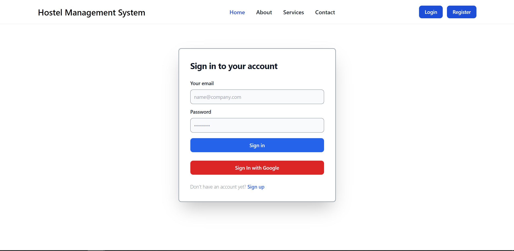

# 🏥 Hostel Management System 💻

## Features

- [x] Manager can manage all the room mates details , allocate hosteller to room , resolve complaint , manage noticeboard
- [x] hosteller can raise complaint , update profile , view hosteller room mates.
- [x] Admin has access do CRUD on all operations
- [x] Notification is send to all user on every changes
- [x] Email Mail Support
- [x] Docker support


## Stacks

- **Frontend**: ReactJs, TailwindCss
- **Backend**: C#, .NET Core Web API
- **External API**: SendGrid, AWS
- **Database**: SQL Server 
- **DevOps**: Docker

## To run

First install docker & docker-compose

```sh
$ bash install.sh
```

Then, update sendgrid api in docker-compose

```sh
EMAIL_API="YOUR_API_KEY" 
```

Then , run the docker compose with sudo permission

```sh
$ sudo docker-compose up --build -d
```


## Snapshots



